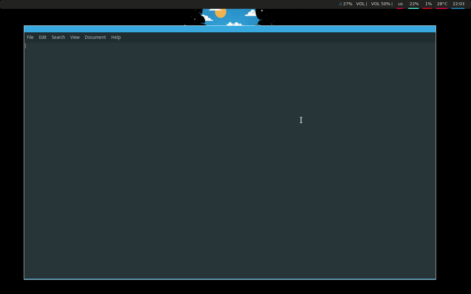

# hadlock  

Hadlock is a (soon to be) tiling window manager for X.  
Built for learning purposes.  

---

---

## Progress

- [x] Floating mode
- [ ] Tiled mode 
- [x] Move windows (Floating)  
- [ ] Move windows (Tiled) 
- [x] Move windows between workspaces(Floating)  
- [ ] Move windows between workspaces(Tiled) 
- [x] Resize windows (Floating) 
- [ ] Resize windows (Tiled) 
- [ ] Snapping widows (Floating) 
- [x] Close window 
- [x] Start terminal 
- [x] Workspaces 
- [ ] Multimonitor support 
- [x] Window decorations 
- [ ] Undecorated windows 
- [ ] Text in decoration 

## Installation
_TBD_

## Configuration
_TBD_

## Testing
In order to test/run hadlock some dependencies are needed:
```
xorg-server-xephyr
xorg-xinit
xorg-xclock
xorg-xeyes
xterm
```

## Honorable mentions
During the development of Hadlock I've found alot of inspiration in other projects and gotten help and insight from people far more experienced than myself.
Therefore I'd like to give credit to these awesome projects and thank those that was kind enough to help me out.

WMs Hadlock was inspired by:
- [BerryWM](https://github.com/JLErvin/berry)
- [LeftWM](https://github.com/leftwm/leftwm)
- [Wtfw](https://github.com/Kintaro/wtftw)

Thanks:
- [lex148](https://github.com/lex148)
