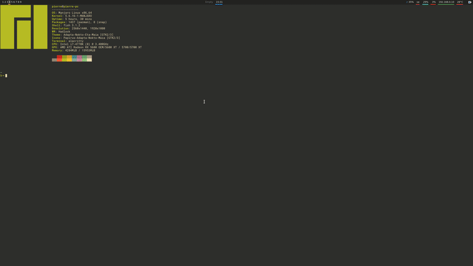

# Hadlock  

  
Hadlock is a tiling and stacking window manager for X.  
It is written completely in rust with an architecture heavily inspired by redux.  

--- 

## Content
- [Feature examples](./resources/layout-examples.md)

- [Progress](./resources/progress.md)

- [Planned features](./resources/planned-features.md)

- [Installation & configuration](./resources/installation-and-config.md)

- [Testing](./resources/testing.md)

---  

## Honorable mentions
During the development of Hadlock I've found alot of inspiration in other projects and gotten help and insight from people far more experienced than myself.
Therefore I'd like to give credit to these awesome projects and thank those that was kind enough to help me out.

WMs Hadlock was inspired by:
- [BerryWM](https://github.com/JLErvin/berry)
- [LeftWM](https://github.com/leftwm/leftwm)
- [Wtfw](https://github.com/Kintaro/wtftw)

Thanks:
- [lex148](https://github.com/lex148)
