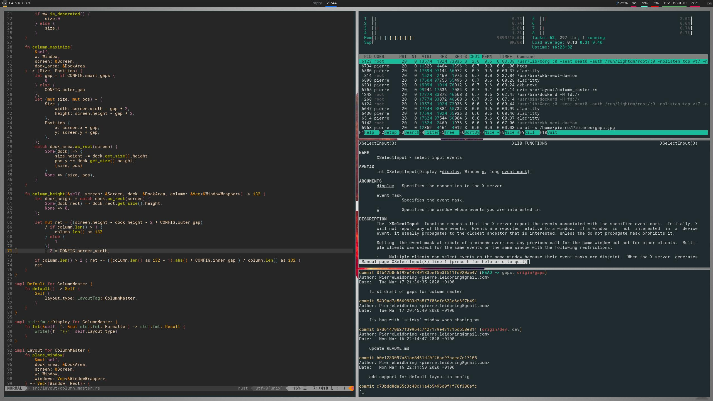
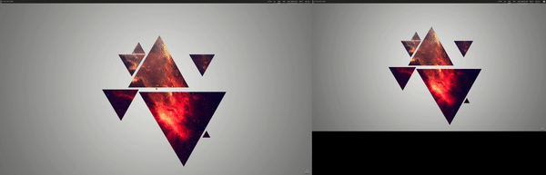
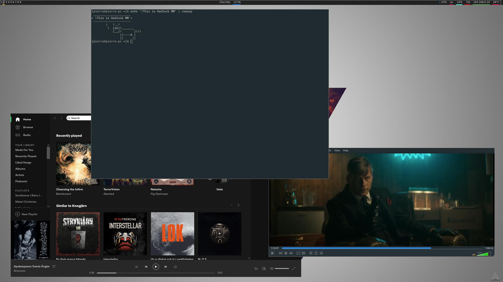
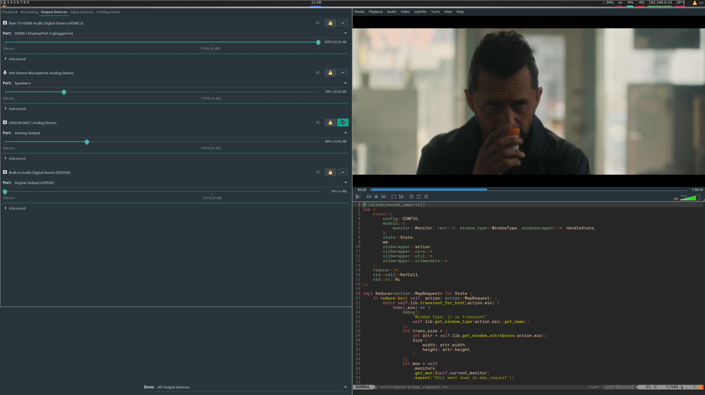

# Hadlock  

[](https://bitbucket.org/lbesson/ansi-colors)
[](https://github.com/XAMPPRocky/tokei)  
Hadlock is a tiling and stacking window manager for X.  
It is written completely in rust with an architecture heavily inspired by redux.  


---
### Gaps

### Multimonitor

---
## Layouts  
### Floating  
---

---
### Master pane layout  
---

---

## Progress

### Mode independent  
- [x] Floating mode
- [x] Tiled mode (Master pane)
- [x] Close window
- [x] Start terminal
- [x] Workspaces
- [x] Multimonitor support 
- [x] Window decorations
### Floating  
- [x] Move windows  
- [x] Move windows between workspaces  
- [x] Resize windows 
- [x] Snapping widows
- [ ] Cycle through windows
### Tiled (Master pane) 
- [x] Swap master window
- [x] Move windows between workspaces 
### Tiled (General)
- [x] Keyboard navigation

---  
### Planned features  
- ~~Custom keybindings( see [issue](/../../issues/38))~~
- Application rules (bind an applicaiton to a specific monitor and workspace)
- ~~Window gaps~~
- Hot reloading config( see [issue](/../../issues/42))  
- Ability to script your own window layout  


## Installation
build with `cargo build --release` and put the binary in a directory in your `$PATH` eg `/usr/local/bin`  
Create `/usr/share/xsessions/hadlock.desktop` containing:  

```
[Desktop Entry]
Encoding=UTF-8
Name=Hadlock
Exec=hadlock ~/.config/hadlock/hadlock.json
Comment=Hadlock - a wm for x
Type=Application

```


## Configuration
The config file is written is json and should be placed in `~/.config/hadlock`  

```json
{
	"borderWidth": 1,
	"borderColor": 	{
		"Custom": "#480222"
	},
	"backgroundColor": {
		"Custom": "#939393"
	},
	"focusedBackgroundColor": "DefaultFocusedBackground",
	"outerGap": 14,
	"innerGap": 6,
	"smartGaps": true,
	"defaultLayout": "ColumnMaster",
	"workspaces": {
		"1": "1",
		"2": "2",
		"3": "3",
		"4": "4",
		"5": "5",
		"6": "6",
		"7": "7",
		"8": "8",
		"9": "9"
	},
	"terminal" : "alacritty",
	"commands": [
		{
			"execTime": "Pre",
			"program": "feh",
			"args": [
				"--bg-scale",
				"~/Pictures/triangles.jpg"
			]
		},
		{
			"execTime": "Post",
			"program": "polybar",
			"args": [
				"example"
			]
		},
	]
}

```

## Keybindings  
Fully customizable  
See example config

## Testing
In order to test/run hadlock some dependencies are needed:
```
xorg-server-xephyr
xorg-xinit
libxinerama
```

Run `./run.sh` to start a test session in a nested X server. The default `xinitrc` in this repo attempts to run `alacritty`, `compton`, and `polybar`. Install them or customize the `xinitrc` to your liking.

## Honorable mentions
During the development of Hadlock I've found alot of inspiration in other projects and gotten help and insight from people far more experienced than myself.
Therefore I'd like to give credit to these awesome projects and thank those that was kind enough to help me out.

WMs Hadlock was inspired by:
- [BerryWM](https://github.com/JLErvin/berry)
- [LeftWM](https://github.com/leftwm/leftwm)
- [Wtfw](https://github.com/Kintaro/wtftw)

Thanks:
- [lex148](https://github.com/lex148)
